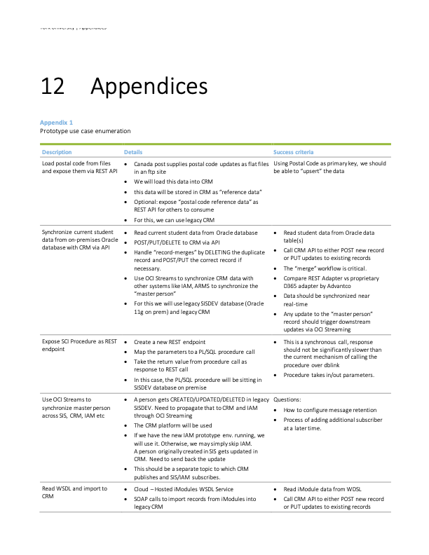
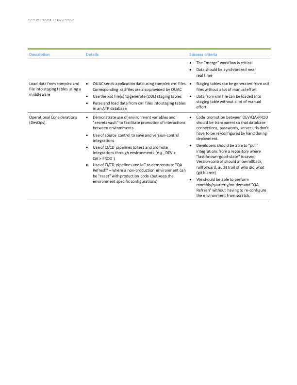

 
 

# Integration Platform Updates

## Sandbox Environment

- Integration developers are already running through use cases to learn the quirks of the OIC platoform
- Developers are also working on testing and CI/CD workflows for integrations
  - https://github.com/firozkabir/oic-person-name (short demo)
  - https://bitbucket.org/pingli2008/ssrp-cli/src/master/ (todo)

## Statement of Work (SOW)

- Deliverables:
  - Design a stack based on York's integration requirements
  - Apply York's use cases to confirm the stack meets requirements
  - Develop governance strategy for the integration platform
  - Develop Infrastructure as Code (IaC) to build the production environment

## Timeline: July - October (TBC)

 
 

# Master Data Updates

## Developing MDM use cases

- https://yuoffice.sharepoint.com/sites/UIT-YorkUSSRPArchitecture-3-MasterDataManagement/_layouts/15/Doc.aspx?OR=teams&action=edit&sourcedoc={5692C3E7-4132-4A85-A901-B239EA50FCC3}

## CMD will be prioritized

## Need SME engagement from ownsers of authorotative sources

 
 

# Data Quality Updates

## Server has been provisioned

## Request for database accounts, local and admin firewall rules have been created

## Analysis of object level grants in progress, request to follow soon
